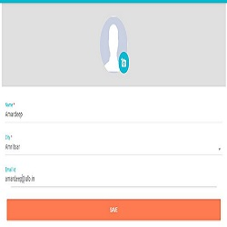

### Writing test cases:
A test case would be create in below manner. In the *tests/* directory create a python file, each methods in test files is intended to implement methods of action from the Page/Component classes.

To automate a new web page like Login page:-


                    
### Step 1: create test_login.py file in 'tests/' to write test case for login,
```python
def test_citizen_login():
    citizen_login()
    pass
```
Inside the test you will use page object classes to perform action.
A page object class will be create and added to appropriate folder in `/pages/`
### Step 2: create a base structure for the page object
For the above test case you need to declare the citizen_login() method in `pages/citizen/login.py`
```python
from framework import PageObject
@PageObject
class LoginPage(Page):
    pass
```
> Note: The page object class name should be kept unique across projects
### Step 3: Identify locators and declare in the page object class
Name of a variable starts from the element type, like
* btn for button
* txt for text
* lbl for label
* drp for dropdown
* chk for checkbox
* rad for radio button
```python
from framework import PageObject, Page
__all__ = ['LoginPage']
@PageObject
class LoginPage(Page):
    class ID:
        txtMobileNumber = "xpath=//label[contains(text(), 'Mobile Number')]"
        btnLogin = "button#login-submit-action"
        btnProfile = "#header-profile"
```
> Note: it is important to add your page object class name to `__all__ = ['LoginPage']`
### Step 4: define a method of actions using locators in the page object class
```python
    def navigate(self):
        return self
        
    def set(self, mobile_number):
        return self
        
    def submit(self):
        return self
```
### Step 5: Call the method of actions from the page object class
As in the step 2 we defined method for the test case, we are continuing by calling the methods of actions defined in the page object class as,
```python
def citizen_login(username=None):
    username = username
    navigate = LoginPage().navigate()
    navigate.set(username).submit()
```

## Lets take a look at Components

To automate a web pages like file upload,



```python
def test_profile_image_upload(upload_photo):
    citizen_login()
    ProfilePage().change_profile_picture(upload_photo)
```
To the base first create a UploadImageComponent component in 'pages/components/common.py'
```python
from framework import Page
__all__ = ['UploadImageComponent']
class UploadImageComponent(Component):
    class ID:
        fileImageUploadPlaceHolder = ".upload-placeholder input,.upload-photo-overlay input"
        profileImagePlaceHolder = "#uploadDrawerGallaryIcon, .gallery-upload-drawer, #photo-picker"
        pass
    def upload_images(self, *images):
        return self
```
> Note: it is important to add your component class name to `__all__ = ['UploadImageComponent', 'CommonComponent']`

Create page object class called ProfilePage in 'pages/citizen/profile.py'
```python
from framework import PageObject, Page
__all__ = ['ProfilePage']
@PageObject
class ProfilePage(Page, UploadImageComponent):
    class ID:
        btnProfileSave = "#profile-save-action"
        btnProfilePhoto = "#profile-upload-icon"
    def change_profile_picture(self, upload_photo):
        click(self.ID.btnProfilePhoto)
        self.profile_upload_image(upload_photo)
        return self
    def save(self):
        click(self.ID.btnProfileSave)
        return self
```
> Note: Multiple page object class name can able to added in `__all__ = ['CitizenProfilePage', 'ProfilePage']`